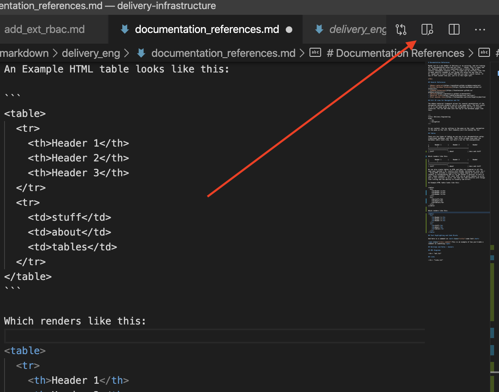
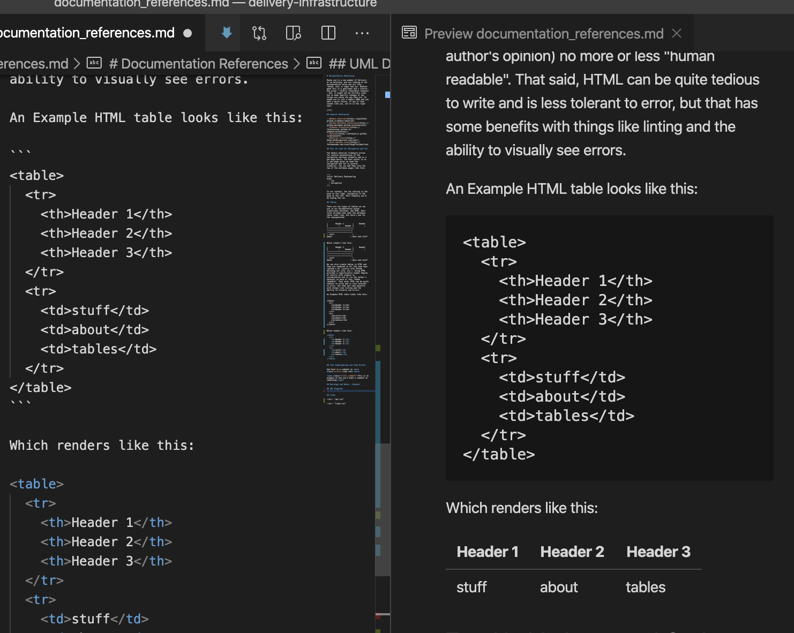

# Documentation References

Is markdown scary for you? Confused why you can't just make a pile a google docs? This guide is to help you navigate markdown effectively.

* [Mermaid](https://mermaid-js.github.io/mermaid/#/)
* [Material Icons](https://materialdesignicons.com/icon/)
* [Font awesome icons](https://fontawesome.com/icons?d=gallery&m=free)

## Tables

There are two types of tables we can use in our documentation setup: traditional markdown (or github markdown), and HTML. Most folks already know what the markdown table looks like, but here's one for the unacquainted:

```
|       Header 1        |     Header 2          |     Header 3          |
|:---------------------:|:---------------------:|:---------------------:|
| stuff                 | about                 | docs and stuff        |
```

Which renders like this:

|       Header 1        |     Header 2          |     Header 3          |
|:---------------------:|:---------------------:|:---------------------:|
| stuff                 | about                 | docs and stuff        |


We can also create tables in HTML and they are rendered in all the same ways (github's UI, Locally with VSCode, building our site, etc.). Using HTML provides a higher degree of control with respect to customization and is more or less "human readable". That said, HTML can be quite tedious to write and is less tolerant to error, but that has some benefits with things like linting and the ability to visually see errors. Use your best judgement.

An Example HTML table looks like this:

```
<table>
  <tr>
    <th>Header 1</th>
    <th>Header 2</th>
    <th>Header 3</th>
  </tr>
  <tr>
    <td>stuff</td>
    <td>about</td>
    <td>tables</td>
  </tr>
</table>
```

Which renders like this:

<table>
  <tr>
    <th>Header 1</th>
    <th>Header 2</th>
    <th>Header 3</th>
  </tr>
  <tr>
    <td>stuff</td>
    <td>about</td>
    <td>tables</td>
  </tr>
</table>

Pro-tip! Instead of going through the motions of building the docker image for your changes, VSCode actually has a markdown render function inside of it you can use to see how things would look in real time, quick is _quite_ convenient when working with visualization or rendering changes. You can enable it in the upper right hand corder:



Once you click it, while you type in real-time you can see things like tables or other visualization components:




## Warnings and banners


## Mermaid


## Ze copy pasta

Traditional; each header matches a row entry that spans the table
```
<table>
  <tr>
    <th></th>
    <th></th>
    <th></th>
  </tr>
  <tr>
    <td></td>
    <td></td>
    <td></td>
  </tr>
</table>
```

More key-value-esk; description on the left, value on the right, no real "header"

```
<table>
  <tr>
    <th></th>
    <td></td>
  </tr>
  <tr>
    <th></th>
    <td></td>
  </tr>
</table>
```

Nested lists
```
<ul>
  <li></li>
  <li></li>
  <li>
    <ul></ul>
    <ul></ul>
    <ul>
      <li></li>
    </ul>
  </li>
</ul>
```

Regular markdown table; centered text

```
|   |   |   |
|:--:|:--:|:--:|
|   |   |   |
```
