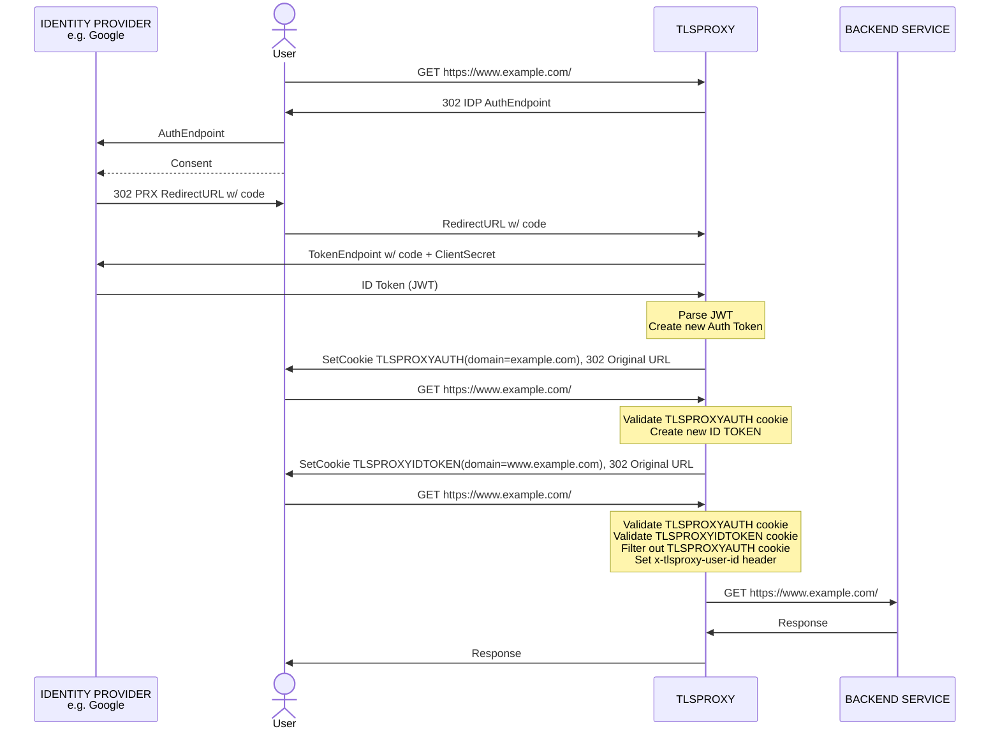
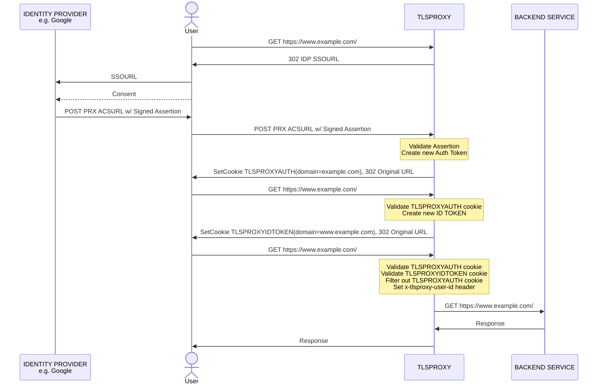

# What is OIDC

Open ID Connect (OIDC) is an authentication protocol built on top of OAuth 2.0. It is designed to verify an existing account (identity of an end user) by a third party application using an Identity Provider site (IDP). It complements OAuth 2.0 which is an authorization protocol.

As an authentication result in the authorization flow, the IDP sends the authenticated user’s information (details about the login session and the end-user) in a JWT token called an ID token.

The OIDC flow returns not only the ID token but also the access token to ensure compatibility with OAuth 2.0 and support identity authorization scenarios. OpenID Connect purpose is to allow users to only log in once to multiple services/sites. This is made possible via the ID token issued for the client’s consumption, which can be passed around the client’s different components as a representation of the successful authentication and the store of user’s profile information. Yet, the ID token should not be used to access APIs. For requesting access to protected resources, you still need to use access tokens. Unlike the ID token, the access token is not intended to carry the user data (except for ID passed as the sub claim) but to transit authorization information, such as scopes determining actions allowed to be taken by the client on the API. Access tokens are for access protected API resources and ID tokens should not be used for API access.

# Oauth stuffs

- The OAuth 2.0 Client initiates an Authorize Code, Hybrid, or Implicit flow. The user's user agent is redirect to https://{project-slug}.projects.oryapis.com/oauth2/auth?client_id=...&....
- Ory OAuth2, if unable to authenticate the user (= no session cookie exists), redirects the user's user agent to the Login Provider URL. The application "sitting" at that URL is implemented by you and typically shows a login user interface ("Please enter your username and password"). The URL the user is redirect to looks like https://example.org/oauth2-screens/login?login_challenge=1234....
- The Login Provider, once the user has logged in, tells Ory OAuth2 some information about who the user is (for example the user's ID) and also that the login attempt was successful. This is done using a REST request which includes another redirect URL like https://{project-slug}.projects.oryapis.com/oauth2/auth?client_id=...&...&login_verifier=4321.
- The user's user agent follows the redirect and lands back at Ory OAuth2. Next, Ory OAuth2 redirects the user's user agent to the Consent Provider, hosted at - for example - https://example.org/oauth2-screens/consent?consent_challenge=4567...
- The Consent Provider shows a user interface which asks the user if they would like to grant the OAuth 2.0 Client the requested permissions ("OAuth 2.0 Scope"). You've probably seen this screen around, which is something like: "Would you like to grant Facebook Image Backup access to all your private and public images?".
The Consent Provider makes another REST request to Ory OAuth2 to let it know which permissions the user authorized, and if the user authorized the request at all. The user can choose to not grant an application any access to his/her personal data. In the response of that REST request, a redirect URL is included like https://{project-slug}.projects.oryapis.com/oauth2/auth?client_id=...&...&consent_verifier=7654....
- The user's user agent follows that redirect.
- Now, the user has authenticated and authorized the application. Next, Ory OAuth2 will run checks and if everything works out, issue access, refresh, and ID tokens.

OAuth2 and OpenID Connect are widely used authorization and authentication delegation protocols that enable secure access to APIs
and web applications.

The Authorization Code flow is the most secure and widely used OAuth2 flow for web applications. Here is the high-level overview
of the Authorization Code flow:

1. The user clicks on a link or button on a web page that requests access to a resource.
2. The user is redirected to the Authorization Server, where they authenticate themselves and grant permission to the requesting application (that's us, openlane).
3. The Authorization Server generates an authorization code and redirects the user back to the requesting application with the authorization code.
4. The requesting application (this is us again) exchanges the authorization code for an access token that can be used to access the protected resource (protected resource being... openlane's authenticated endpoints).

```mdx-code-block
import Mermaid from "@site/src/theme/Mermaid";

<Mermaid
  chart={`sequenceDiagram
    participant User
    participant Client
    participant AS as OAuth2 Server
    User->>+Client: Click "Login with OAuth2"
    Client->>+AS: Redirect to /authorize
    AS->>+User: Prompt for login and consent
    User->>+AS: Enter credentials and consent
    AS->>+Client: Redirect to client callback URL with code
    Client->>+AS: Exchange code for token
    AS->>+Client: Return token
    Client-->>Client: Process and store token
`} />
```

### Step 1: Get the user's permission

The user clicks on a link or button on a web page that requests access to a resource. The requesting application sends a request
to the Authorization Server with the following parameters:

- `response_type`: The value of this parameter should be set to `code` to indicate that the Authorization Code flow will be used.
- `client_id`: The ID of the client that is making the request.
- `redirect_uri`: The URL where the Authorization Server will redirect the user after they grant permission. The `redirect_uri`
  needs to be pre-registered with the OAuth2 client.
- `state`: A random value that is generated by the requesting application to prevent cross-site request forgery (CSRF) attacks.
- `prompt` (optional): This parameter takes one or more the following values (space delimited):
  - `none`: This value indicates that the Authorization Server should not display any user interaction pages. If the user is not
    already authenticated or has not already granted consent, the Authorization Server returns an error.
  - `login`: This value indicates that the Authorization Server should prompt the user to login before processing the access
    request.
  - `consent`: This value indicates that the Authorization Server should prompt the user to grant consent before processing the
    access request.
  - `registration`: This value indicates that the Authorization Server should display the registration UI instead of the login UI.
    The exact URL is governed by the `urls.registration` config value. It is set to `/ui/registration` by default.
- `scope` (optional): The scope of the access request, which specifies what resources the requesting application can access.
- `max_age` (optional): specifies the allowable elapsed time in seconds since the last time the End-User was actively
  authenticated by Ory OAuth2 and OpenID Connect. If the elapsed time is greater than this value, the Login HTML Form must be
  shown and the End-User must re-authenticate.
- `id_token_hint` (optional): ID Token previously issued by Ory OAuth2 and OpenID Connect being passed as a hint about the user's
  current or past authenticated session with the Client. If the user identified by the ID Token is logged in or is logged in by
  the request, then the Authorization Server returns a positive response; otherwise, it returns an error, typically
  `login_required`. It does not matter if the ID Token is expired or not.

### Step 2: Redirect to the Authorization Server

The user is redirected to the Authorization Server, where they authenticate themselves and grant permission to the requesting
application. The Authorization Server could ask the user to log in or prompt them to authorize the access request.

### Step 3: Redirect back to the app

If the user grants permission, the Authorization Server generates an authorization code and redirects the user back to the
requesting application with the authorization code.

### Step 4: Exchange code for token

The requesting application exchanges the authorization code for an access token that can be used to access the protected resource.
The requesting application sends a POST request to the Authorization Server with the following parameters:

- `grant_type`: The value of this parameter should be set to `authorization_code` to indicate that the authorization code will be
  exchanged for an access token.
- `client_id`: The ID of the client that is making the request.
- `client_secret`: The client secret that is used to authenticate the client.
- `code`: The authorization code that was received in the previous step.
- `redirect_uri`: The URL where the Authorization Server redirected the user after they granted permission.

The Authorization Server validates the request and responds with an access token and a refresh token (if enabled). The requesting
application can use the access token to access the protected resource.

## Modifying the authorization code flow

### Get a refresh token

By default, the Authorization Code flow returns an access token that expires after a certain period of time. To get a refresh
token, you need to include the `offline_access` scope in the access request.

:::note

The client needs to be allowed to request the `offline_access` scope and the user has to accept that the client may use the
`offline_access` scope on the consent screen.

:::

The `offline_access` scope allows the requesting application to obtain a refresh token that can be used to obtain a new access
token without requiring the user to re-authenticate.

### Get an OpenID Connect ID token and validate it

To obtain an ID token, you need to include the `openid` scope in the access request. The ID token is a JSON Web Token (JWT) that
contains information about the authenticated user. The ID token can be used to obtain information about the user such as their
name and email address.

:::note

The client needs to be allowed to request the `openid` scope and the user has to accept that the client may use the `openid` scope
on the consent screen.

:::

To validate the ID token, you need to decode the JWT and verify the signature using the public key of the Authorization Server
which is available at

```text
https://{project.slug}.projects.oryapis.com/.well-known/jwks.json
```

The ID token contains a signature that is used to verify that the token has not been tampered with.

## Perform PKCE

PKCE (Proof Key for Code Exchange) is a security extension to the Authorization Code flow that is designed to prevent code injection attacks. In the PKCE flow, the client generates a random code verifier and transforms it into a code challenge that is sent to the Authorization Server. The Authorization Server uses the code challenge to validate the authorization code.

## OIDC Flow



## SAML Flow

